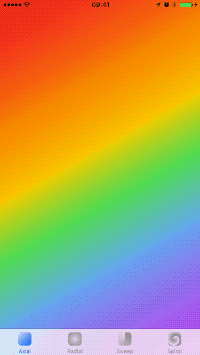

# Rainbows

**Rainbows** is a **Metal-backed** alternative to `CAGradientLayer` that is **incredibly fast**. It provides drawing of **axial** (aka "linear"), **radial** (aka "circular"), **sweep** (aka "angular" aka "conical") and even trippy **spiral** gradients at **no less than 60fps**.



## Usage

Let's say you want to add a trippy noir spiral gradient to your view:

```swift
import Rainbows

let gradientLayer = GradientLayer()
gradientLayer.gradient = Gradient(colors: [
    UIColor.black.cgColor, UIColor.white.cgColor
])
gradientLayer.configuration = .spiral(
    center: CGPoint(x: 0.5, y: 0.5),
    angle: 0.0 * CGFloat.pi * 2.0,
    scale: 1.0
)
gradientLayer.frame = view.layer.bounds
view.layer.addSublayer(gradientLayer)
```

Or just skip the detour via `self.layer` and use a convenient `GradientView`:

```swift
import Rainbows

let gradientView = GradientView()
gradientView.gradient = Gradient(colors: [
    UIColor.black.cgColor, UIColor.white.cgColor
])
gradientView.configuration = .spiral(
    center: CGPoint(x: 0.5, y: 0.5),
    angle: 0.0 * CGFloat.pi * 2.0,
    scale: 1.0
)
```

## Installation

The recommended way to add **Rainbows** to your project is via [Carthage](https://github.com/Carthage/Carthage):

    github 'regexident/Rainbows'

## License

**Rainbows** is available under the **MPL-2.0 license**. See the `LICENSE` file for more info.
